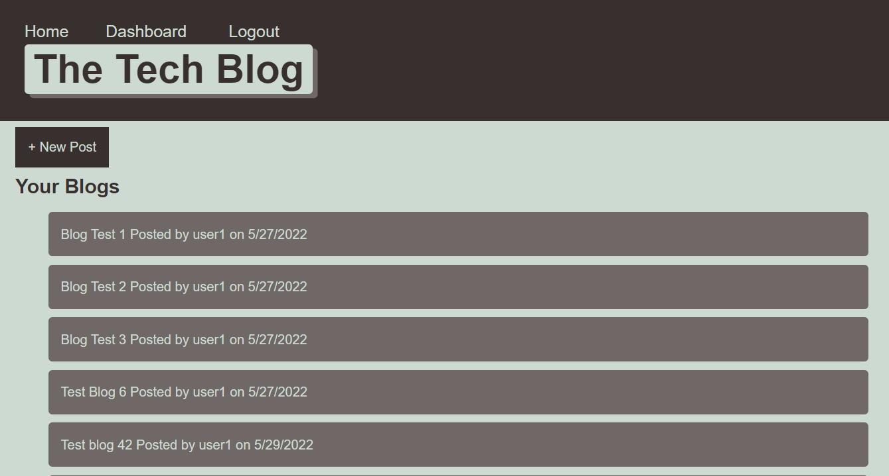

# Tech-Blog
Week 14 Challenge - Full-Stack Blog Site

---
**This project borrowed heavily from the module 13 & 14 code base**

**The CSS is a modified version of the module 6 stylesheet**

---

## Description

A site allowing a user to create an account, post blogs, and add comments. Built using JavaScript, Node.js, MySQL, Handlebars, CSS, with Sequelize, Express.js, Express-Session, and bcrypt packages.

## Table of Contents
* [Installation](#installation)
* [Usage](#usage)
* [Tests](#tests)
* [Links](#links)

---
## Installation

**To create the database**

A .env file will need to be created at the root of the project, with the following code, including the user's password:

*DB_NAME='blog_db'*

*DB_USER='root'*

*DB_PW=''*

If running locally, type the following at the root directory in MySQL prompt: 
*"source db/schema.sql"*

Or visit:
*https://murmuring-island-53348.herokuapp.com/*

**To start the server**

If running locally, type the following in a bash terminal: 
*"npm start"*

---
## Usage

If not logged in the user can view existing blogs by other users. The user can create an account, and when logged in, they can write their own blogs, or add comments to other blogs.

The functionality will be expanded to allow users to edit their blogs and comments, or delete them.

---
## Tests

Tech Blog Homepage

Dashboard View

Create New Blog View

Blog View to Add Comments

---
## Links

[Tech Blog on GitHub](https://github.com/philmcgarty/tech-blog)

[Tech Blog Deployed on Heroku](https://murmuring-island-53348.herokuapp.com/)